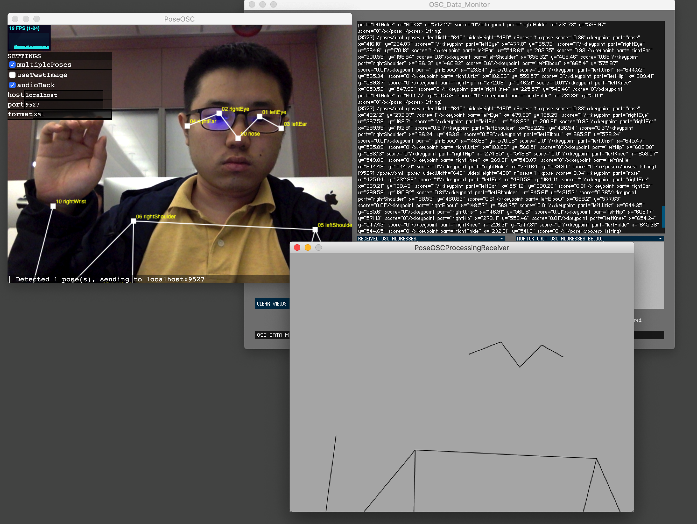
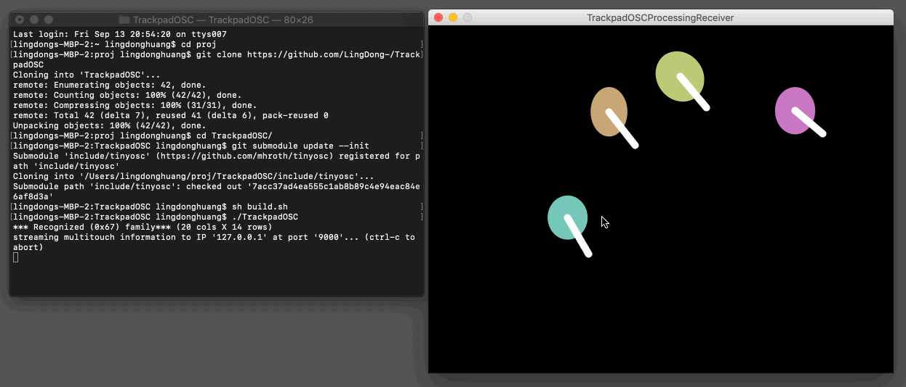

# Lingdong Project Index

Projects which [Lingdong Huang](https://github.com/LingDong-) developed or contributed to, with the support of the Frank-Ratchye STUDIO for Creative Inquiry, September 2018 - December 2020: 

---

## STUDIO Research Projects

### Teenie Harris Archive Interactive

An [interactive installation](https://github.com/LingDong-/THP) for the Carnegie Museum of Art (code not yet public), and [associated data repositories](https://github.com/CreativeInquiry/TeenieHarrisProject).

### PEmbroider

[PEmbroider](https://github.com/CreativeInquiry/PEmbroider) is a Java library for computational embroidery in Processing.

---

## Educational Templates

### Mediapipe Handpose and Facemesh Demos

[A collection of minimalistic demos](https://github.com/LingDong-/handpose-facemesh-demos) using mediapipe handpose with tensorflow.js.

### Networked Bodypix demo

- **networked-bodypix**: [Code](https://glitch.com/edit/#!/networked-bodypix) • [App](https://networked-bodypix.glitch.me/)

### p5.js Mobile Events

- **sensors-duo**: Sharing sensor data between 2 mobile devices visiting the page. [Code](https://glitch.com/edit/#!/sensors-duo) • [App](https://sensors-duo.glitch.me/)
- **sensors-chorus**: Sharing sensor data between all mobile devices visiting the page. [Code](https://glitch.com/edit/#!/sensors-chrous) • [App](https://sensors-chrous.glitch.me/)
- **sensors-rooms**: Sharing sensor data between mobile devices in the same virtual "room", distinguished by the URL query. [Code](https://glitch.com/edit/#!/sensors-rooms) • [App](https://sensors-rooms.glitch.me/)

### Server Data Templates

- **2d-chat**: A public chatroom where users can insert text anywhere on a canvas. Uses p5.js. [Code](https://glitch.com/edit/#!/2d-chat) • [App](https://2d-chat.glitch.me/)
- **piano-rooms**: A multiplayer multitouch piano using Tone.js. [Code](https://glitch.com/edit/#!/piano-rooms) • [App](https://piano-rooms.glitch.me/)

### Reusable Backends

- **postnget**: SQLite database responding HTML POST and GET methods allowing user to store, share and retrieve arbitrary piece of data with a short hash as the key. [Code](https://glitch.com/edit/#!/postnget) • [App](https://postnget.glitch.me/)
- **hiscore**: A shared highscore server for arbitrary games using a SQLite database responding to URL queries. [Code](https://glitch.com/edit/#!/hiscore) • [App](https://hiscore.glitch.me/)

--- 
## Useful Tools

### PoseOSC

Send realtime human pose estimation data to your apps with [this Node/Electron app using PoseNet](https://github.com/LingDong-/PoseOSC).

### TrackpadOSC

Transmit [Mac multitouch trackpad data ove OSC](https://github.com/LingDong-/TrackpadOSC), so apps you make can be controlled with custom gestures. Includes demos for Processing and openFrameworks.

### Poisson Filling

- **ofxPoissonFill**: Fast Poisson fill shader in OpenFrameworks. [Code](https://github.com/LingDong-/ofxPoissonFill)
- **poissonfill-wasm**: online CPU poisson fill compiled from C to WebAssembly [Code](https://glitch.com/edit/#!/poissonfill-wasm) • [App](https://poissonfill-wasm.glitch.me/)
- **poisson-fill**: WebGL poisson fill shader. [Code](https://glitch.com/edit/#!/poisson-fill) • [App](https://poisson-fill.glitch.me/)
- **PoissonFill.java** Processing version [Code](https://gist.github.com/LingDong-/09d4e65d0c320246b950206db1382092)

### Skeleton-Tracing

A new algorithm for retrieving topological skeletons as a set of polylines from binary images. [Implemented in a variety of languages](https://github.com/LingDong-/skeleton-tracing), including C, C++, Java, JavaScript, Python, Go, C#/Unity, Swift, Rust, Julia, WebAssembly, Haxe, Processing, and OpenFrameworks.

### PContour

- [Java/Processing library](https://github.com/LingDong-/PContour) for finding contours in binary images.
- [JavaScript port](https://gist.github.com/LingDong-/b99cdbe814e600d8152c0eefeef01ab3) of the same library.

### Interesting Polygon Archive

A [collection of polygon data](https://github.com/LingDong-/interesting-polygon-archive) in various formats for testing computational geometry algorithms.

### Voronoi Diagrams and Distance Transforms:

- **jumpflood.js**: Voronoi & Distance Transform in WebGL. [Code](https://glitch.com/edit/#!/jfa) • [App](https://jfa.glitch.me/)
- **voronoi-wasm**: Voronoi based on a Fortune's sweep's C++ implementation compiled to WebAssembly. [Code](https://glitch.com/edit/#!/jfa) • [App](https://voronoi-wasm.glitch.me/)

### .NPY (numpy) format reader/writer/viewer

- **npy-rw.js**: .npy reader and writer for JavaScript. [Code](https://gist.github.com/LingDong-/b24f172ba0888976143463a8801e2040)
- **tensor-viewer**: Online .npy visualizer. [Code](https://glitch.com/edit/#!/tensor-viewer) • [App](https://tensor-viewer.glitch.me/)

### Other shader stuff

- **upsamp-thresh**: Upsampling and thresholding shader in WebGL [Code](https://glitch.com/edit/#!/upsamp-thresh) • [App](https://upsamp-thresh.glitch.me/)

---

## Other

### Soli Sandbox Demos

Programs demonstrating the Soli radar sensor in Google Pixel 4 mobile devices, developed for Soli Sandbox: 

- **soli-fly**: shoo a housefly with a swipe gesture. [Video](https://vimeo.com/448186906) • [Code](https://glitch.com/edit/#!/soli-fly) • [App](https://soli-fly.glitch.me/)
- **soli-jello**: spank a bouncy cube with a swipe gesture. [Video](https://vimeo.com/448186018) • [Code](https://glitch.com/edit/#!/soli-jello) • [App](https://soli-jello.glitch.me/)
- **soli-slap**: slap a face with a swipe gesture.  [Code](https://glitch.com/edit/#!/soli-slap) • [App](https://soli-slap.glitch.me/)
- **soli-spank**: spank an butt with a swipe gesture. [Code](https://glitch.com/edit/#!/soli-spank) • [App](https://soli-spank.glitch.me/)
- **soli-pet**: pet a puppy with a reach gesture. [Code](https://glitch.com/edit/#!/soli-pet) • [App](https://soli-pet.glitch.me/)
- **soli-arrows**: prevent being shot by arrows by blowing them away with a swipe gesture. [Code](https://glitch.com/edit/#!/soli-arrows) • [App](https://soli-arrows.glitch.me/)
- **soli-dolly**: Image that zooms out as you walk towards the screen, simulating dolly zoom effect. [Code](https://glitch.com/edit/#!/soli-dolly) • [App](https://soli-dolly.glitch.me/)

We have also created two "dashboard" (debug view) apps for previewing Soli and other sensor data: 

- **soli-dashboard**: Shows Soli events [Code](https://glitch.com/edit/#!/soli-dashboard) • [App](https://soli-dashboard.glitch.me/)
- **soli-dashboard-plus**: Shows Soli events, plus gyroscope & accelerometer [Code](https://glitch.com/edit/#!/soli-dashboard-plus) • [App](https://soli-dashboard-plus.glitch.me/)

### Ambigrammatic Figures

[Grotesque faces](https://a2p.bitmark.com/v2/artworks/326c6e057e5bd48c5edae92e7143085170d61a9de0d1699b2884c0adda89b49dd623542aa60575eba3a4b27e23b4cc96403d1a39743f835b28b7d7410691ef89) that are legible both upside-down and right-side up.

### ScribblePuzzle

This [work-in-progress](https://github.com/LingDong-/scribblepuzzle) is not yet public.

### Hand Segmentation Neural Net

This [work-in-progress](https://github.com/LingDong-/handpix) is not yet public.
